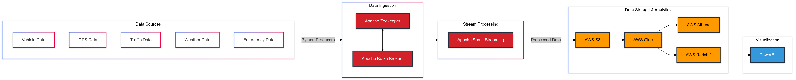

# Smart City Real-time Data Streaming Pipeline

## Description
This project implements an end-to-end real-time data streaming pipeline for a Smart City system. It simulates various IoT devices generating city data, processes this data in real-time, and stores it for analysis and visualization. The pipeline demonstrates modern data engineering practices and integrates multiple cloud and open-source technologies.

## System Architecture


The pipeline consists of several components:
1. Data Generation Layer (IoT Simulators)
2. Data Ingestion Layer (Apache Kafka)
3. Stream Processing Layer (Apache Spark)
4. Storage Layer (AWS S3, AWS Redshift)
5. Analytics Layer (AWS Athena, PowerBI)

## Technologies Used
- **Data Generation**: Python
- **Message Broker**: Apache Kafka, Apache Zookeeper
- **Stream Processing**: Apache Spark
- **Containerization**: Docker
- **Cloud Storage**: AWS S3
- **Data Warehouse**: AWS Redshift
- **Data Catalog**: AWS Glue
- **Query Engine**: AWS Athena
- **Identity Management**: AWS IAM
- **Visualization**: PowerBI
- **Database Client**: DBeaver

## Prerequisites
- Docker and Docker Compose
- Python 3.8+
- AWS Account with appropriate permissions
- PowerBI Desktop (for visualization)
- DBeaver (optional, for database querying)

## Installation & Setup

### 1. Clone the Repository
```bash
git clone [repository-url]
cd smart-city-real-time-project
```

### 2. Environment Setup
Create a `.env` file in the project root:
```env
KAFKA_BOOTSTRAP_SERVERS=localhost:9092
AWS_ACCESS_KEY_ID=your_access_key
AWS_SECRET_ACCESS_KEY=your_secret_key
AWS_REGION=your_region
```

### 3. Start Docker Containers
```bash
docker-compose up -d
```

### 4. Install Python Dependencies
```bash
pip install -r requirements.txt
```

## Project Components

### IoT Data Generators
- Vehicle Information Generator
- GPS Information Generator
- Traffic Information Generator
- Weather Information Generator
- Emergency Incident Generator

### Data Processing
- Kafka Topics Configuration
- Spark Streaming Jobs
- AWS Glue Crawlers Setup

### Storage and Analytics
- S3 Bucket Configuration
- Redshift Cluster Setup
- Athena Query Setup
- PowerBI Dashboard Configuration

## Usage

### 1. Start Data Generation
```bash
python src/main.py
```

### 2. Run Spark Streaming Job
```bash
python src/spark-city.py
```

### 3. Monitor Data Flow
- Kafka UI: http://localhost:9021
- Spark UI: http://localhost:8080

## AWS Configuration

### Required IAM Roles
1. S3 Access Role
2. Glue Crawler Role
3. Redshift Role
4. Athena Query Role

### S3 Bucket Policy
```json
{
    "Version": "2012-10-17",
    "Statement": [
        {
            "Effect": "Allow",
            "Principal": {
                "Service": "s3.amazonaws.com"
            },
            "Action": "s3:PutObject",
            "Resource": "arn:aws:s3:::your-bucket/*"
        }
    ]
}
```

## Troubleshooting

### Common Issues
1. Kafka Connection Issues
   - Verify Zookeeper is running
   - Check broker connectivity

2. Spark Streaming Errors
   - Verify schema compatibility
   - Check memory allocation

3. AWS Permission Issues
   - Verify IAM roles and policies
   - Check S3 bucket permissions


## Acknowledgments
- Project created as part of DataMasteryLab training
- Visit [datamasterylab.com](https://datamasterylab.com) for more data engineering content


---
